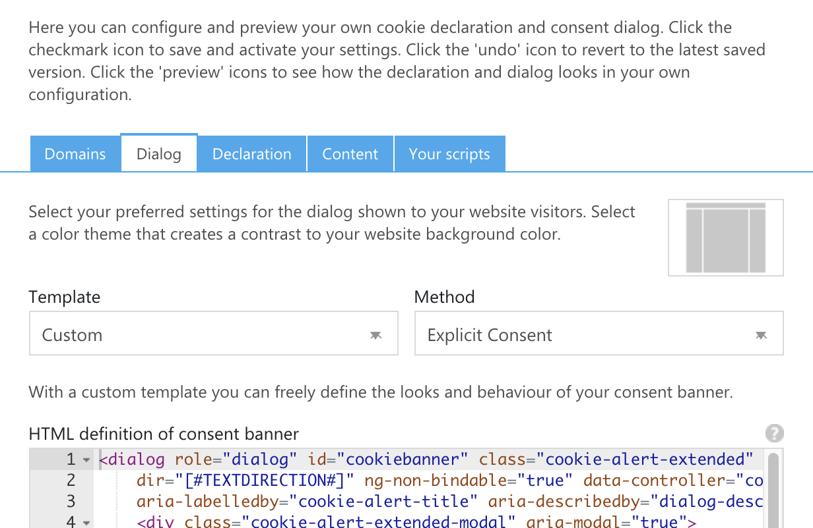
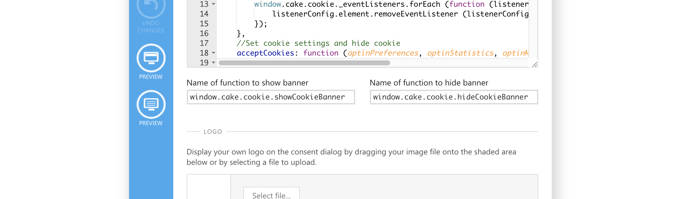
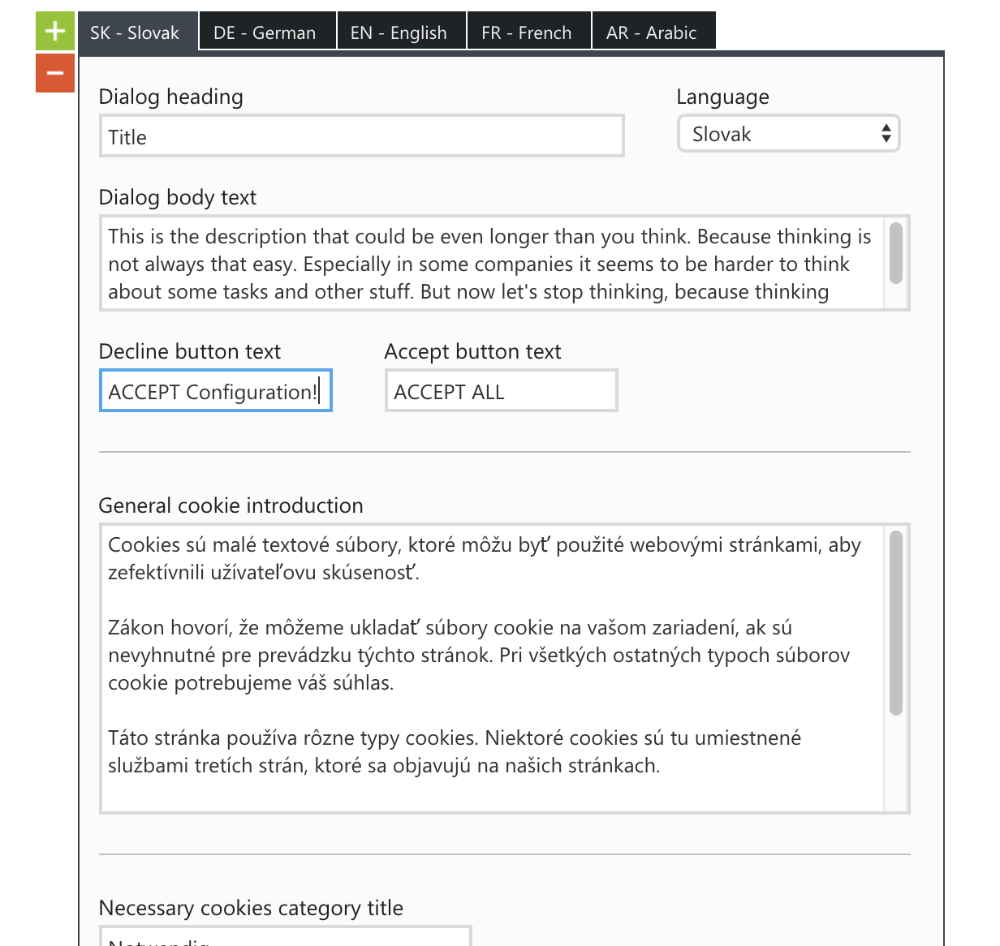

<AlertInfo alertHeadline="Modifiable">
Please ensure to comply with the corporate identity.
</AlertInfo>

# Cookie Alert

In order to be legally on the safe side, the cookie alert must be used in most cases. This modal informs the user about cookies and also gives the user the possibility to set his personal cookie preferences. This cookie alert is designed as an overlay because it is legally required that the user first interacts with this element before he can use the site.

This component uses the [button component](../Button/Button.md) and the checkbox of the [form component](../Form/Form.md). Therefore you have to include the CSS of these both components in order to get the cookie alert displayed correctly!

<ContentRack
    fields='
        "preview": {
            "src": "examples/CookieAlertExample.html",
            "type": "link"
        },
        "<html>":{
            "src": "examples/CookieAlertExample.html",
            "type": "content",
            "selector": "#app"
        }
    '
 />

<Iframe src="examples/CookieAlertExample.html" style="min-height: 28.5rem; max-height: 28.5rem;" title="Cookie alert" alt="CookieAlertExample" />

The cookie alert uses the `<dialog>` element. In order to get the correct styling applied to it, you have to use the `.cookie-alert` class.
This dialog element is the transparent black background. Inside this `<dialog>` element you should create a `<div>` with the class `.cookie-alert-modal` applied to it. This is the wrapper element for all the content elements of this component:

* title as a `<h2>` element with the class `.h5`
* description as a `<p>` tag and the class `.cookie-alert-description`
* more-details link `.cookie-alert-detail-link`
* *accept all* cookies button
* the cookie configuration collapsible `<div>` `.cookie-alert-configuration`
  * the checkboxes wrapper `<div>` `.cookie-alert-configuration-settings`
    * the labels of each checkbox `.cookie-alert-checkbox-label`
  * the *accept configuration* button

The detailed structure of this component can be seen in the above example. Best practice is to place the cookie alert component as the first element in the body of each page. Additionaly it is mandatory to place a link to your cookie-information page into the description text! **Be aware, that on the cookie-information page there shouldn't be any cookie-alert. Because otherwise the visitor is not able to read the information before accepting anything. Thus you should not save or use any cookies on this page because the visitor has not accepted anything.**

## Accessibility

Because this component is a legal requirement, special attention should be paid to good accessibility! One important thing is to not use a `<div>` but a `<dialog>` element to tell especially screenreaders that this element is an overlay which stays in front of other content. Also some aria-attributes should be added. The `aria-labelledby` and the `aria-describedby` attributes should reference to the appropriate element in the modal (title and description). Also the special `open` attribute of the `<dialog>` element should get set correctly. You can find a description of this html element on it's dedicated page on the [MDN web docs](https://developer.mozilla.org/de/docs/Web/HTML/Element/dialog). It's also a good practice to set the [role element](https://developer.mozilla.org/en-US/docs/Web/Accessibility/ARIA/Roles/dialog_role) (`role="dialog"`) for supporting browsers. The modal div (`.cookie-alert-modal`) has the attribute `aria-modal="true"` attatched to it.

For the collapsable cookie configuration at the bottom of the cookie dialog, you should add `aria-controls="id"`. The configuration (`.cookie-alert-configuration`) needs also some additional attributes for accessibility: `aria-controls="id"`, `aria-labelledby="id"`, `aria-expanded="false"`. What these attributes are doing can be read in the two examples [W3: dialog-modal](https://www.w3.org/TR/wai-aria-practices/examples/dialog-modal/dialog.html) and [W3: accordion](https://www.w3.org/TR/wai-aria-practices/examples/accordion/accordion.html).

To also get the correct tab order for users only using their keyboard or other tools, the tabindex of the *accept all* button should be set to `tabindex="1"` and all the other clickable elements of the cookie alert to `tabindex="2"`. So the user first must tab through the cookie alert, before accessing the website itself. The *accept all* button has tabindex 1 because this element should have the inital focus.

## JavaScript

With our JavaScript we have focused on the usage in [CookieBot](https://cookiebot.com/) because this is the most used tool by our users. Because of that we have written this component's JavaScript in the "old-fashioned" way with `ES5 syntax`. This way you can simply copy paste our JavaScript into your *CookieBot* console. But more to this further below.

To make your `HTML` work with our JavaScript, you have to apply the coorect `data-controller`s. Every element, that causes some JavaScript code execution needs one of the following attributes:

* the `<dialog>` element should have the attribute `data-controller="cookie-alert"` attatched to it
* the more details link `.cookie-alert-detail-link` has the attribute `data-controller="cookie-alert/detail-link"`
* for the *accept all* button `data-controller="cookie-alert/button/accept"`
* the configuration element `.cookie-alert-configuration` needs the `data-controller="cookie-alert/configuration"` attribtue attatched
* the *accept configuration* button has the attribute `data-controller="cookie-alert/button/configuration"`

Our JavaScript parses the elements with the above mentioned `data-attributes` and adds three click event listener to the two buttons (*accept all* and *accept configuration*) and to the *more details* link. These click event listeners implement some functionality like setting up the appropriate accessibility attributes or disabling the primary CTA button when showing more details.
The JavaScript of this component exposes three methods that can be used:

### Accept cookies

`window.cake.cookie.acceptCookies: function (optinPreferences, optinStatistics, optinMarketing) {…}`. This method simply saves the configuration set by the user. If the user for example clicks the *accept all* button, all three parameters are set to `true`:

```javascript
acceptAllButton.addEventListener ("click", function () {
    window.cake.cookie.acceptCookies (true, true, true);
});
```

### Show cookie alert

`window.cake.cookie.showCookieAlert: function () {…}`. With this method you can show the cookie alert and initialize all the event listeners needed by this component.

```javascript
window.cake.cookie.showCookieAlert (forcedFocus = true);
```

This method has also an optional property `forcedFocus`, which can force the customers browser to keep focus on the relevant elements of our cookie alert. This property is set to `true` as default but if `forcedFocus` is set to `false`, it will not change anything in the default focus handling of the browser.

### Hide cookie alert

`window.cake.cookie.hideCookieAlert: function () {…}` This method simply hides the cookie alert and removes all events added in the function above. **But please be sure to save the cookie configuration before with the first method mentioned!**

```javascript
window.cake.cookie.hideCookieAlert ();
```

## CookieBot integration

### Set up the template

We have developed our cookie alert especially for the [CookieBot website](https://cookiebot.com/). This means that this component also works with the [CookieBot console](https://manage.cookiebot.com/en/manage).

To set our component as your cookie-bot consent, just log into your [CookieBot console](https://manage.cookiebot.com/en/manage) and switch to the Domain group you'd like to adjust. In this dashboard you have to switch to the *Dialog* tab.
There you have to set the *Template* to `Custom` and the *Method* to `Explicit Consent` like in the following example. Depending on your language these fields could have a different name.



Afterwards you should be able to see 3 different textareas:

* HTML
* CSS
* Javascript

You can simply copy our sourcecode templates from the textareas below into the appropriate field.

#### HTML


#### CSS


#### JavaScript


In addition you have to adjust the `Name of function to show alert` and the `Name of function to hide alert` with the following values like in the screenshot below:

* Name of function to show alert: `window.cake.cookie.showCookieAlert`
* Name of function to show alert without forcing the browser focus to stay on the exetended cookie alert: `window.cake.cookie.showCookieAlertWithoutForcedFocus`
* Name of function to hide alert: `window.cake.cookie.hideCookieAlert`



### Set up the content

You can enter the content for our component as usual via the [CookieBot console](https://manage.cookiebot.com/en/manage). To do this, switch to the content tab and then create the texts, if not already done.

> #### Special exception when maintaining the content!
>
> But you have to pay attention to a special exception when maintaining the content! The field `Decline button text` is not the text for a reject button, but for the button `accept configuration`.
> This had to be solved this way, because CookieBot unfortunately does not allow any further individual text fields.


